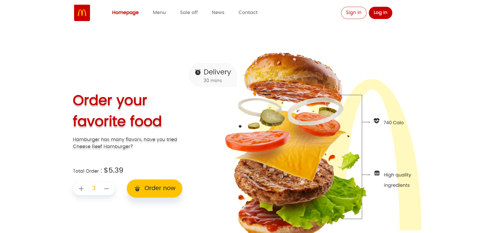

<h1 align="center"> McDonald's Food Delivery Website 🍔 </h1>

---
### This project is written by HTML and CSS
### Main project by https://sabzlearn.ir
### Run the program with live-server on `index.html`
### See demo on [This URL](https://devmasen.github.io/learning-grid/)
### I used CSS grid layout to write some examples and projects.
### There is two mini project named shopping-cart and gallery, run them by live-server
### You can use this repo as a resource for learning this powerful CSS layout
### You may learn concenpts in learning-files directory first
